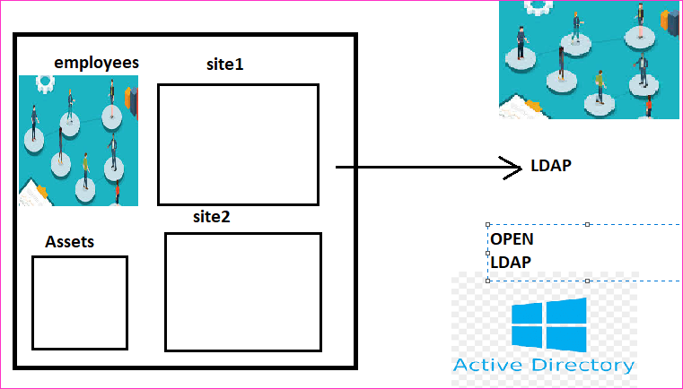

Active Directory
----------------

* Usage of LDAP in organization

* Active Directory
   * Tree: This is hierarchy in one site
   * Forest: 
      * Collection of Trees
   * Group Policies
   * Object:
      * User
      * Group
      * System/Device
* To create a new Active Directory to add users, Windows Servers have 
   * Domain Controllers

* As discussed in the class now we have a Domain Controller 
    * name: qtdc1.derectdevops.blog
    * domain name: derectdevops.blog
    * BIOS name: DDBLOG
    * users:
      * ram
      * bheem
    * Groups:
      * RRR
* Now to use these users in 
    * Azure:
       * Allows to import users into Azure AD
          * Primary is still Domain controller
          * Password write back
          * Azure AD Connect
    * AWS
       * Allows to import users in AWS Directory Services
          * AWS AD Connect
       * Federated User:
          * IAM => Identity Providers:
             * Configure Domain Controller
             * Every user in AD will be external user, so we need to use security token service (STS)

Active Directory with AWS
--------------------------

* [refer here](https://aws.amazon.com/blogs/security/how-to-connect-your-on-premises-active-directory-to-aws-using-ad-connector/) for the official docs of AD in AWS

Azure AD B2B(Business to Business) and B2C()
--------------------

* Azure B2B:
    * Invite Guest User
* Azure AD B2C

AWS Cognito
-----------

* AWS Cognito can be used

  