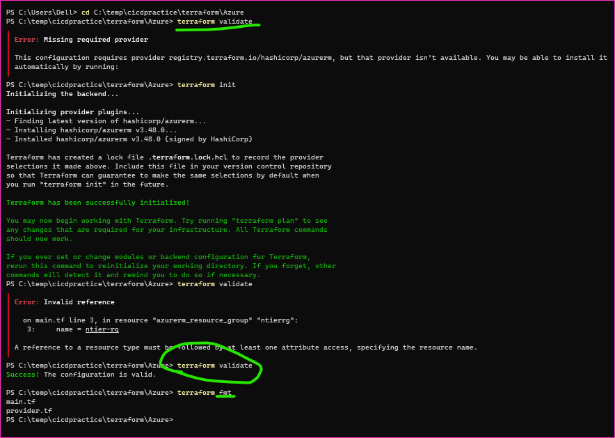

Terraform contd..
----------------

Activity: Create Virtual Network in Azure
-----------------------------------------
* Manual Steps:

### Writing template for the above in terraform

* Terraform takes the folder as input and reads all the .tf files and while validating, applying or destroying tries to treat all of the .tf files as one file.
* To Create dependencies we can use depends on meta argument [refer here](https://developer.hashicorp.com/terraform/language/meta-arguments/depends_on) for the official docs.
* The resource name in terraform is `<resource_type>.<name>`
* Notes:
   * The commands which we started following `init, fmt, validate, apply`

* To work effectively with terraform templates we need to understand Hashicorp Configuration Language
* How to parametrized the template

### Hashicorp Configuration Language (HCL)

