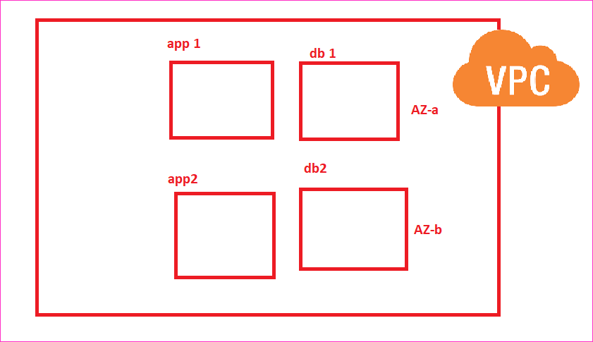
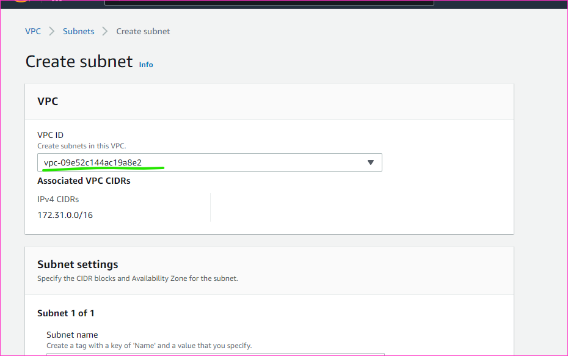
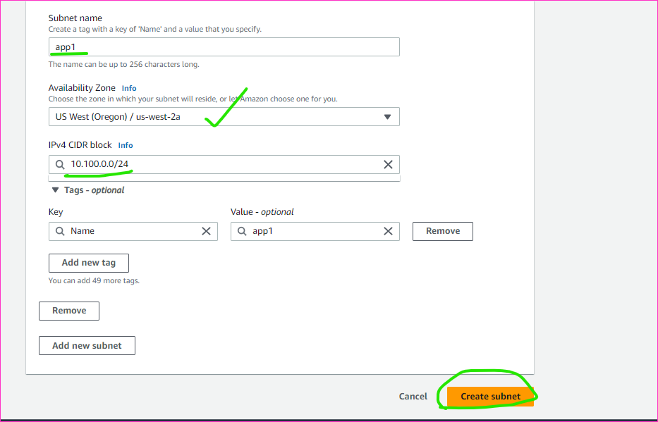

Terraform contd...
-------------------
AWS - ntier
---------------
* Expectation

[refer here](https://registry.terraform.io/providers/hashicorp/aws/latest/docs/resources/subnet) for the official docs of aws vpc subnet.
* To access outputs i.e. attributes of a resources syntax is 

* To create multiple resource [refer here](https://developer.hashicorp.com/terraform/language/meta-arguments/count)
* Lets using terraform fuctions to make futher improvements

[refer here](https://developer.hashicorp.com/terraform/language/functions) for the official docs of terraform functions.
* 
![preview]
![preview]
![preview]